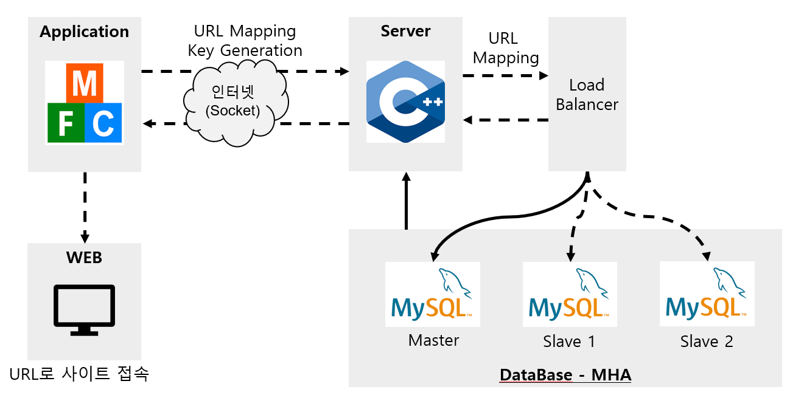
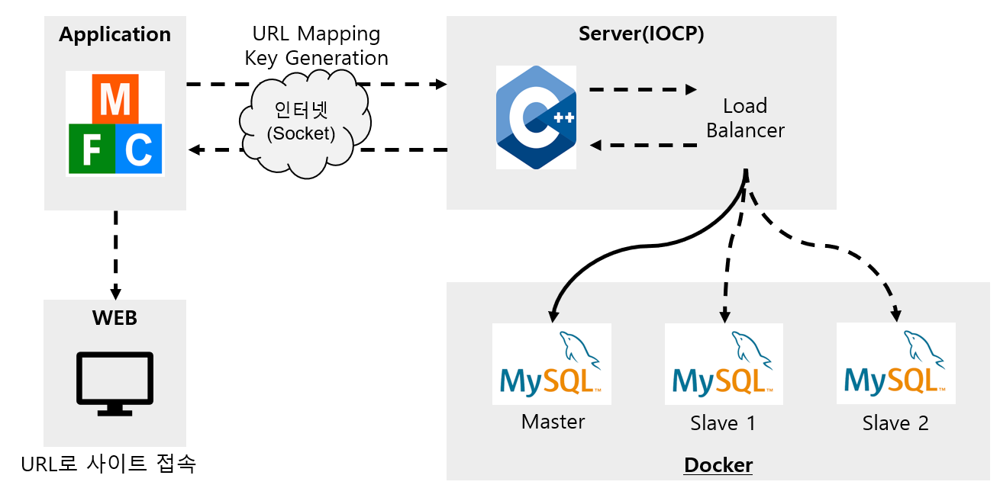

# Smilegate-Personal-Project
스마일게이트 개인 프로젝트 GitHub 입니다.
# URLShortener Application

## 서비스 개요
|서비스|개요|
|---|---|
|URL Shortner|- URLLong 입력시 ShortUrl 출력<br>- 생성된 ShortUrl을 통해서 원래 url 접속 가능<br>- 생성된 URLShort를 DB에 저장|


## 기술스택
- C++ 14
- MFC
- Mysql 8.xx
- Docker
- Github

## 아키텍처
- 초기 아키텍처


- 수정 아키텍처


## 제공 기능
- URL Mapping : 짧아진 도메인 주소를 본래의 긴 주소로 치환해서 응답해주는 기능
- URL Insert : Mapping 실패 시, 생성한 ShortUrl을 DB에 저장하는 기능
- ShortAlgorightm : 짧은 식별자를 생성하여 긴 URL을 짧은 URL을 생성해주는 기능
- Load Balancer(Rate Limiter) : DBMS 모든 URL 매핑 요청마다 매핑 정보를 담당하면 부하가 걸리기에 요청량 조절하는 기능
- Short or Long URL 입력 시 해당 URL 웹사이트 열어주는 기능
- 본래는 ShortURL을 입력하면 원래 페이지로 응답해줘야 하나, 특성상 힘들기 때문에, ShortURL을 입력하고 브라우저 버튼 클릭시, 원래 URL이 출력되고 그 URL로 브라우저가 열림.

## 세부 기능 구현
### 1. DBMS 구현
```class DBConnectionPool
{
public:
	DBConnectionPool();
	~DBConnectionPool() {}

public:
	DBConnectorRef GetDBCppol();
	void ReturnDBpool(DBConnectorRef db);

private:
	queue<DBConnectorRef> _connectorPool;
	atomic<int> useCount;

	SpinLock s;
};

extern DBConnectionPool* dbPool;
  ```

### 2. DB URL Mapping 구현
```char* DBConnector::MappingURL(string url)
{
	//쿼리문 실행
	sprintf(sql, "SELECT * FROM urltable WHERE URLSHORT='%s'", url.c_str());
	cout << sql << endl;
	if (mysql_query(s_Connection, sql) != 0)
		return nullptr;
	sql_Result = mysql_store_result(s_Connection);
	if((sql_Row = mysql_fetch_row(sql_Result)) == NULL)
		return nullptr;
	cout << sql_Row[0] << " : " << sql_Row[1] << endl;
	mysql_free_result(sql_Result);
	cout << "Mapping Success" << endl;

	return sql_Row[0];
}```

### 3. DB URL Insert 구현
```bool DBConnector::InsertURL(string urlL, string urlS)
{
	//쿼리문 실행
	sprintf(sql, "INSERT INTO urltable (URLLONG, URLSHORT) VALUES ('%s','%s')", urlL.c_str(), urlS.c_str());
	if (mysql_query(m_Connection, sql) != 0)
		return false;
	cout << "Input 성공" << endl;
	return true;
}```

### 3. ShortAlgorightm 구현
```char ShortAlgorightm::alphaMap[65] = "ABCDEFGHIJKLMNOPQRSTUVWXYZabcdefghijklmnopqrstuvwxyz0123456789-_";
string ShortAlgorightm::convIDtoURL(int str[]) {
    string url;
    int n = 0;
    for (int i = 1; i <= 7; i++) {
        n = 0;
        n += str[(i * 6) - 6] * 1;
        n += str[(i * 6) - 5] * 2;
        n += str[(i * 6) - 4] * 4;
        n += str[(i * 6) - 3] * 8;
        n += str[(i * 6) - 2] * 16;
        n += str[(i * 6) - 1] * 32;
        url.push_back(alphaMap[n]);
    }
    return url;
}

string ShortAlgorightm::convURLtoShort(const char* str, int len)
{
    BYTE* dest = new BYTE[32];
    SHA256_Encrpyt((BYTE*)str, len, dest);
    int tmp[42] = { 0, };
    int pos = 0;
    for (int i = 0; i < 5; i++) {
        pos = (i+1) * 8;
        while (dest[i] != 0) {
            tmp[--pos] = (int)dest[i] % 2;
            dest[i] /= 2;
        }
    }
    delete[] dest;
    string a = convIDtoURL(tmp);
    return a;
}
```

### 4. URL 실행 구현
```void CApplicationClientDlg::OnBnClickedBrowser()
{
	try {
		GetDlgItemText(IDC_URLL, URL_INPUT);
		if (URL_INPUT.GetLength() == 0) {
			return;
		}
		int len = URL_INPUT.GetLength();
		char* send_Buffer = new char[len + 1];
		send_Buffer = URL_INPUT.GetBuffer(0);
		send_Buffer[len] = '\0';
		//만약 short일 경우 long 받아오고 아니면 그냥 실행.
		if (_socket->IsCheck(send_Buffer)) {
			if (_socket->Send(send_Buffer, 1) == -1)
				return;
			if (_socket->Recv() == -1) {
				SetDlgItemText(IDC_URLS, "Error");
				return;
			}
			//오류 체크 넣어줘야함
			URL_OUTPUT = _socket->getNormalString().c_str();
		}
		else {
			URL_OUTPUT = URL_INPUT;
		}
		char browser[MAX_PATH];
		HFILE h = _lcreat("dummy.html", 0);
		_lclose(h);
		FindExecutable("dummy.html", NULL, browser);
		DeleteFile("dummy.html");

		SetDlgItemText(IDC_URLS, URL_OUTPUT);
		ShellExecute(NULL, "open", browser, URL_OUTPUT, NULL, 0);
	}
	catch (exception e) {
		SetDlgItemText(IDC_URLS, "Input URL");
	}

}```

## 작동 화면


## 프로젝트 하면서 아쉬웠던 점
###1. 로드 밸런서
- 한 컴퓨터에서 여러개의 mysql을 돌리기 위해서 Docker를 사용함.
- 단순하게 10개의 connector을 만들어서 5개는 slave1, 5개는 slave2를 접속하게 하다보니, 너무 단순하게만 연결한 것 같음.
- 이러한 밸런서가 시간을 줄여주는지 아직 테스트 해보지 못함.

###2. 패킷
- 처음에는 따로 클래스를 만들어서 패킷 직렬화 해주는 코드를 짜려고 하였으나 실력이 부족하여 짜지 못함. 그래서 사용할 때마다 사용하는 클래스에서 패킷 생성.
- 메모리 풀을 사용해서 패킷 공간을 만들어보려고 하였으나 아직 못함 -> 추후 고쳐볼 예정

###3. 통신
- Scatter, Getter이 send, recv에 필요한 걸로 알고 있으나, 어떤식으로 구현하여야 하는지 공부중. 아직 꽤 남은 관계로 한번 해볼 예정.

###4. 전체적
- 전체적으로 코드가 깔끔하게 짜진 것 같지 않습니다.
- 기능 구현에 중점을 두다 보니, 가독성 부분이나 코드 리뷰 부분에 대해서 많이 놓친 것 같습니다.
- DBMS 구현이 너무 어려워서 못한 점이 너무 아쉽습니다.


## 코드 중 확인 받고 싶은 부분
- [URLSession.cpp](MainServer/URLSession.cpp)
- Server에서 URLSession에서 패킷 생성하는 부분이 있는데


## 개발관련 과정에서 궁금했던 부분
- 실제로 메모리 풀을 구현하는게 속도 부분에서 좀 더 빠른지?
- IOCP 코어 개발할 때,
